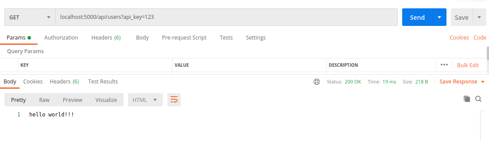
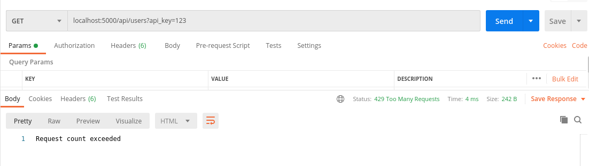
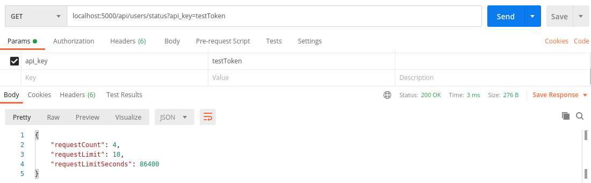

# API Request Limiter Example Application

This application illustrates a method of limiting API requests for specific tokens based on a sliding window time interval.

Redis an in memory data structure store is used for keeping track of requests made by specific tokens.

### The following technologies were used:
* Express
* Typescript
* Node.js
* Docker
* Redis
* Jest - unit testing framework

REST API 
* http://localhost:5000/api/users?api_key=testToken
* http://localhost:5000/api/users/status?api_key=testToken






### Getting Started

In the root of the project, run the following docker command.
The first command will build the dockers.  The second command invokes the Node.js application and Redis docker.
```
> docker-compose build
> docker-compose up
```

Run unit tests
```
> backend/docker/npm.sh run test
```

